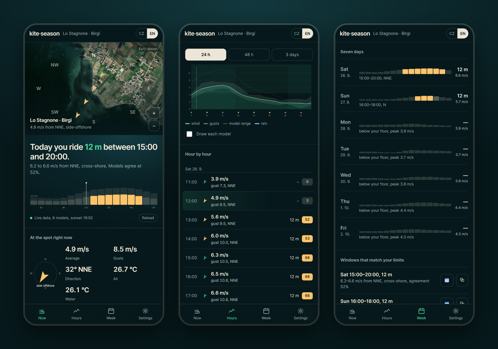
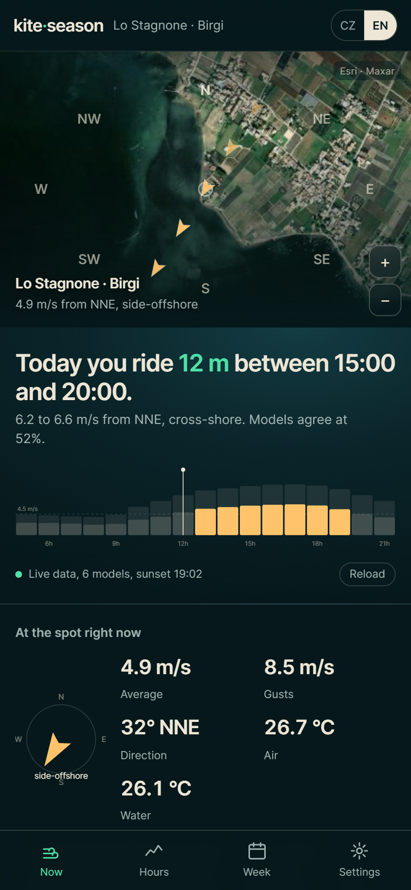
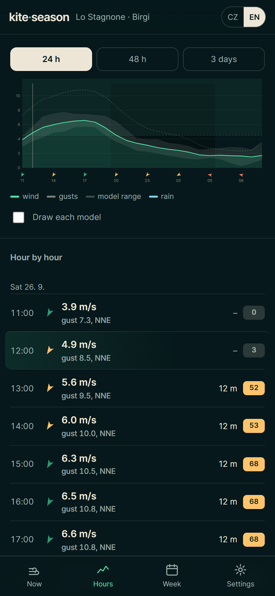
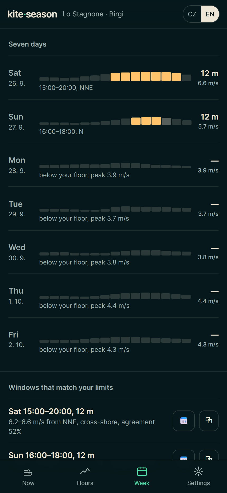
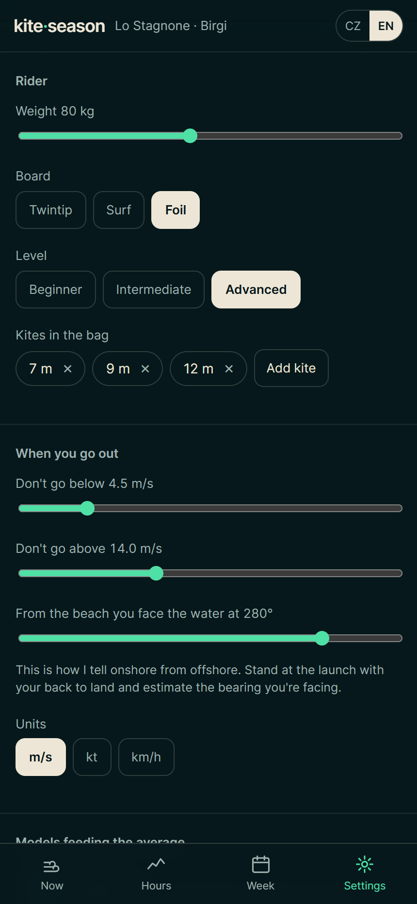

# kite·season

**Should I go kiting today — and on which kite?** One phone screen that answers
it for Lo Stagnone, the lagoon north of Marsala in Sicily: six weather models
averaged into one forecast — hour by hour from 24 hours to three days ahead,
and the whole week at a glance — measured against *your* weight, board, kites
and limits.

**Live:** <https://kiteseason.vercel.app> · Czech & English · no sign-up, no tracking

<p align="center">
  
</p>

---

## What it tells you

The first thing on the screen is a sentence, not a chart:

> **Today you ride 12 m between 15:00 and 20:00.**
> 6.2 to 6.6 m/s from NNE, cross-shore. Models agree at 52 %.

Everything under it is the evidence for that sentence.

| | |
|---|---|
| **Now** | The verdict, a satellite map of the spot with wind arrows, an hour strip of today that lights up the rideable hours, and the conditions right now — wind, gusts, direction, air and water temperature, wave height, and which wetsuit that adds up to. |
| **Hours** | 24 h / 48 h / 3 days of wind and gusts, with a pale band showing how far apart the models are and a line for your floor. Every hour gets a score from 0 to 100 and the kite you would take out. |
| **Week** | Seven days at a glance, each with its daylight hours laid out as a strip, then the **windows** — stretches of at least two hours that meet your limits, with the wind, direction and model agreement for each. |
| **Settings** | Your weight, board (twintip · surf · foil), level, the kites you actually own, the wind range you ride in, which way the beach faces, units (m/s · kt · km/h) and which models feed the average. |

## How it decides

**Six models, one number — and an honest spread.** The forecast comes from
[Open-Meteo](https://open-meteo.com): five global models always (ECMWF IFS,
ICON, GFS, Météo-France ARPEGE/AROME, UK Met Office), plus a 2 km regional
model when the spot sits inside its grid — ICON-2I over the Mediterranean,
KNMI HARMONIE over north-west Europe. Those two only see three days ahead,
and the app says so. The consensus is the plain average of the models you
tick, the same idea behind Windguru's *Mix*; the **agreement** figure is how
tightly they cluster. High agreement: the window is solid. Low: *"decide in the
morning off the station."*

**The kite is yours, not a table's.** The ideal size is worked out from the
wind, your weight, your board (a foil needs about half the canvas of a
twintip) and your level — then snapped to the nearest kite **in your bag**.
If even your biggest is too small, or your smallest too big, the hour is
marked down instead of pretending.

**Direction matters as much as speed.** You set the bearing you face from the
launch; every hour is then read as onshore, side-onshore, cross-shore,
side-offshore or offshore. Offshore — the wind that carries you away from the
beach — drops an hour's score hard, whatever the speed.

**The score** starts from where the wind sits between your floor and your
ceiling, then subtracts for gusty air (gusts more than 25 % over the average),
the wrong direction, rain, a kite you don't own, and darkness. Sunset is
computed on the device for the spot's own coordinates.

**Trust, but check.** The *Enter station reading* button takes the average,
gust and direction from the station at the beach and sets them next to what
the models had for that hour — the gap tells you how far to trust them today.
The week view also remembers what it showed you last time: *"1.8 m/s more than
last time you looked."*

## Design choices

- **One file.** The whole app is a single `index.html` — markup, styles and
  script, no framework, no build step, no dependencies. It opens from any
  static host, or straight from disk.
- **Nothing leaves your phone.** No account, no analytics, no cookies. Your
  settings and the trend baseline live in your browser's own storage; the only
  outbound calls are to the public forecast and map services.
- **Never a blank screen.** If the forecast service can't be reached, the app
  runs on clearly labelled sample data rather than showing nothing; if the
  satellite tiles are blocked, an embedded aerial photo of the spot stands in.
- **Phone first.** Built for one hand on a beach: large type, a bottom tab bar,
  safe-area aware, and it can be pinned to the home screen as a full-screen
  app.
- **Bilingual.** Czech or English, picked from the browser and switchable at
  the top — including decimal commas and day names.

<p align="center">
  
  
  
  
</p>

<sub>Screenshots: live forecast for Lo Stagnone on 26 September 2026, rider set
to 80 kg on a foil with a 4.5 m/s floor.</sub>

## Run it

```bash
git clone https://github.com/Martin8O/kiteseason.git
cd kiteseason
npx serve .        # or any static server — or just open index.html
```

Deploying is the same: put `index.html` on any static host. The live copy runs
on Vercel.

## Data & credits

- Weather forecasts — [Open-Meteo Forecast API](https://open-meteo.com/en/docs)
  (ECMWF, DWD, NOAA, Météo-France, UK Met Office, ItaliaMeteo-ARPAE, KNMI)
- Sea surface temperature & waves — [Open-Meteo Marine API](https://open-meteo.com/en/docs/marine-weather-api)
- Satellite imagery — Esri World Imagery (© Esri, Maxar)

A forecast is not a guarantee. Look at the water, check the station, and ride
within your limits.

---

Built by [Martin Svoboda](https://svobodamartin.dev) with Claude.
